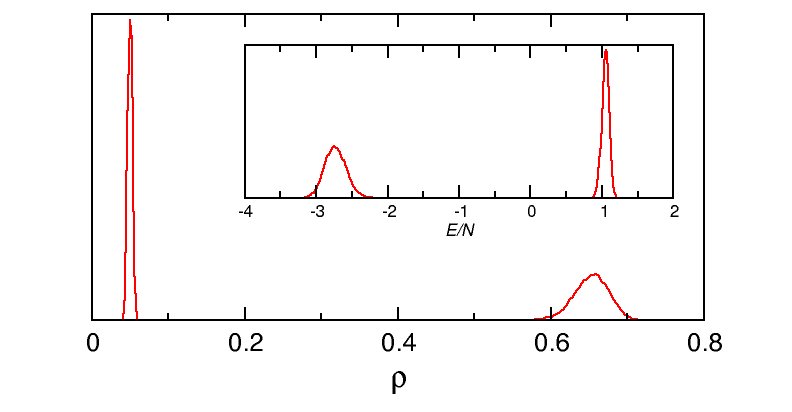
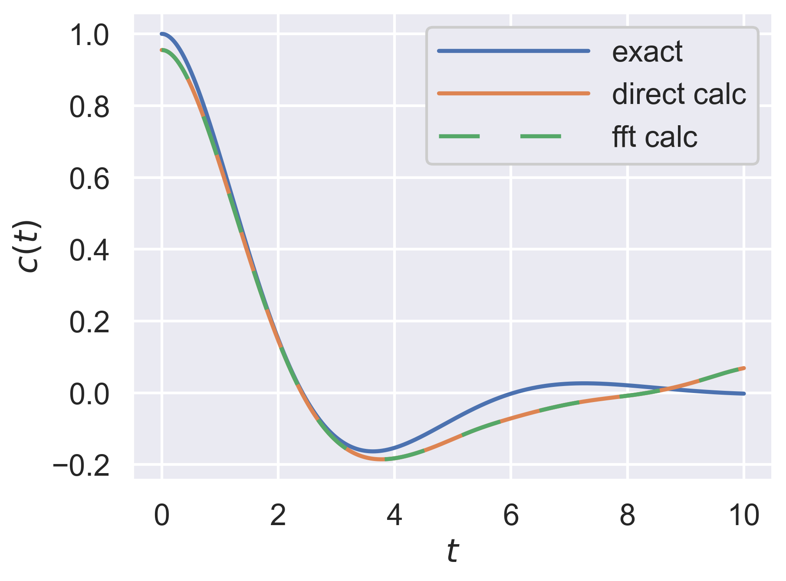
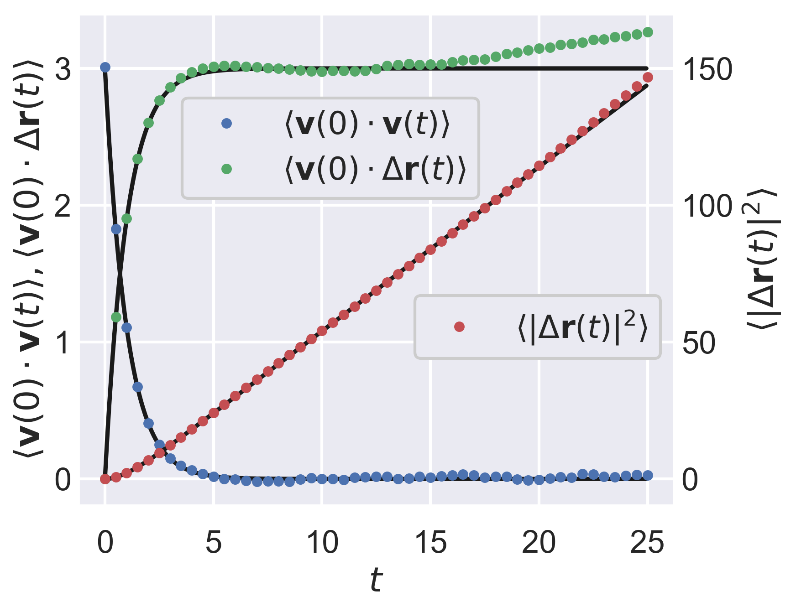

# Brief Guide to Python Examples
This subdirectory contains Python versions of some of the example programs.
Some details of tests carried out on the programs are also given.
Do not expect to duplicate these results,
they are simply a guide as to the kind of behaviour to expect.
If you find a definite programming error,
please report it via the [Issues](https://github.com/Allen-Tildesley/examples/issues) tab above
(you will need to be signed into GitHub to do this).

Python has some advantages over Fortran:
it is an interpreted language, rather than a compiled one,
which allows faster code development,
and it has a natural (and readable) programming style.
Variables may be created and redefined at runtime, as required.
Object-oriented programming fits very well with the Python design,
but it is well suited to other styles as well.
It is widely used as a vehicle to introduce students to scientific programming.
For an excellent introductory text, see:

* _Learning Scientific Programming with Python,_ C Hill (Cambridge University Press, 2015).

Python has one major drawback, when compared with Fortran and other compiled languages:
it is very slow in execution.
To partially counter this,
the [NumPy](http://www.numpy.org/ "NumPy home page") package offers more efficient handling of array structures.
The syntax of NumPy is surprisingly close to that of Fortran in some respects,
especially for combining arrays.
On top of this, NumPy and the [SciPy](https://www.scipy.org/ "SciPy home page") package
provide a huge variety of scientific libraries,
and our Python examples make extensive use of these.
Nonetheless,
any code which cannot be handled in vectorized form by NumPy will still run slowly.
Several strategies are available to address these issues
(for example, [Cython](http://cython.org/ "Cython home page"),
[SWIG](http://www.swig.org/ "SWIG home page"),
and F2PY which is part of NumPy),
but we do not attempt to follow these here.
As always,
the main aim of these examples is to illustrate ideas in the text,
not to provide programs for practical use.
The reader should feel free to experiment with ways to make the programs run faster!

In the past few years, the community has been making the transition from Python 2 to Python 3.
There are some incompatibilities between the two,
and since a choice had to be made,
we have settled on __Python 3__ for these examples.
We indicate this by the string
```
#!/usr/bin/env python3
```
at the top of each source file.
On many systems,
this will allow the files to be run directly by typing their name, for example `./sample_mean.py`;
otherwise it will be necessary to type, for example, `python3 sample_mean.py`,
or just `python sample_mean.py`,
depending on your particular installation of Python.
(Of course, in most cases, it will also be necessary to input data to the program.)
The examples _will not work_ with Python 2!
They have been tested with Python 3.6.0.
For an introduction to the differences between Python 2 and Python 3,
see the [What's New in Python 3.0](https://docs.python.org/3/whatsnew/3.0.html "What's New in Python 3.0") page.
The most obvious changes are

1. `print(a)` is a function; `print a` will return an error.
2. An expression like `1/2` will return a float; if you want a truncated integer, use `1//2`.
3. Various methods, such as `dict.keys()`, return views,
and various functions, such as `zip`, return iterators, instead of lists.

Anyone coming from a Fortran background should note the use of indentation in Python
to indicate the range of conditional constructs and loops;
there is no `end if` statement!
Fortran experts
should also be aware that indices for arrays
(and other entities) follow the C-convention of numbering from 0 upwards.
Arrays cannot have negative indices; rather, the notation `a[-1]` refers to
numbering backwards from the end of the array.
A more subtle point is that, in the slice notation `a[i:j]`,
the upper index `j` is _excluded_, so for example `a[1:3]` consists of the elements
`a[1]` and `a[2]`,
whereas in Fortran the analogous notation `a(i:j)` refers to elements `i` through `j` _inclusive_.
Yet more subtlety lies in the distinction between
an assignment statement which makes a fresh copy of an object,
such as an array or array slice,
and an assignment which merely gives a name to a view of that object.
In the second case,
no new memory locations are used, and
changing the value associated with one of the objects will affect both of them:
they are really the same object.
This is a powerful, and memory-efficient, approach, but can be confusing!

## Data Input
In the Fortran examples we use a `namelist` to input a few parameters from standard input,
but Python does not have this.
Instead,
to provide a keyword based syntax,
we input these values using the widespread [JSON](http://www.json.org/ "JSON home page") format.
As a minimum, the program will expect to read `{}` (an empty list),
and on a Linux/Unix/bash system a typical command line would be
```
echo '{}' | ./mc_nvt_lj.py
```
or similar.
To change the parameters, the JSON list might include the new values like this
```
{ "nblock":20, "nstep":1000, "temperature":2.0 }
```
Alternatively the list may be supplied in a file,
for instance `run.inp` containing
```
{
"nblock":20,
"nstep":10000,
"temperature":2.0
}
```
and the program run like this
```
./mc_nvt_lj.py < run.inp
```
As indicated, the `"key":value` pairs may be set out on different lines if you wish.
The appearance is very similar to a Python dictionary,
and indeed the data is loaded and parsed into a dictionary for further processing.
Note carefully that we use a colon `:` rather than an equals sign to separate the
key from the value,
and that the keys should be enclosed in double quotes `"..."`.
To avoid some fairly basic exceptions later in the program,
we usually type-check the data
(Python enthusiasts may disapprove of this)
so integer values must not have a decimal point,
while floating-point values must have one
(and at least one digit following the point, for example `1.0`, otherwise JSON raises an exception).
String values need to be enclosed, like the keys, in double quotes.
Boolean (logical) values are indicated by `true` or `false`
(whereas in Python they are denoted `True` and `False` respectively).
The variables which may be set in this way are typically considered one by one in our programs:
those whose names correspond to keys supplied in the input file are given the input values,
while the others are given values taken from another `defaults` dictionary.

## Initial Configuration
Simulation runs for bulk liquids require a starting configuration which can usually be prepared using
the `initialize.py` program.
The default parameters produce an FCC configuration of 256 atoms at reduced density &rho;=0.75,
writing out just the positions (for an MC program) to a file `cnf.inp`.
You would run the program as described above,
for instance on a Linux/Unix/bash system like this
```
echo '{}' | ./initialize.py
```
If the parameter `"velocities":true` is supplied within the JSON list,
then positions and velocities are written to the file,
corresponding to a reduced temperature _T_ = 1.0.
These values of &rho; and _T_ (see below) lie in the liquid region of the Lennard-Jones phase diagram.
Non-default values may, of course, be supplied for this or other models.
The `cnf.inp` file may then be copied to the directory in which the run is carried out.
Typically, runs produce a final configuration `cnf.out`
(which may be renamed to `cnf.inp` as a starting point for further runs)
and intermediate configurations `cnf.001`, `cnf.002` etc during the run.

Some of the programs simulate a single chain of atoms, without periodic boundary conditions.
Initial configurations for these may also be prepared using the `initialize.py` program,
selecting `"molecules":"chain"`, an appropriate number of atoms, for example `"n":13`,
and `"velocities":true` if required. There is an option `"constraints":true` if the velocities
should be chosen with constraints applied relative to the bonds between neighbouring atoms in the chain.

A utility program,
`adjust.py` takes in an MC or MD configuration and
scales the velocities to change the kinetic energy per atom by a specified amount,
and/or the positions (and the box length) to change the density by a specified amount.
You may prefer to write your own program or script to perform these types of operation.

## Visualizing configurations
Our simulation configuration files have a very simple format:
the first line is the number of molecules,
the second line is the periodic box length (we always use cubic boxes),
or occasionally the bond length (for chain molecules which are simulated without a box),
and the third and subsequent lines each contain the coordinates of one atom or molecule.
The first three numbers on each of these lines are always the (x,y,z) position,
in simulation units (e.g. Lennard-Jones &sigma;=1).
The rest of the numbers on each line contain velocities, orientation vectors etc.,
as appropriate.

This format is not compatible with most molecular visualization programs,
such as [JMOL](http://jmol.sourceforge.net/)
or [VMD](http://www.ks.uiuc.edu/Research/vmd/).
However, conversion into the basic [XYZ](https://en.wikipedia.org/wiki/XYZ_file_format) format
is easily achieved using a simple program, script, or editor. For example,
on most Linux/Unix systems, the `awk` language will be available:
```
awk '(NR==1) {print} (NR==2) {print "Comment line"} (NR>2) {printf "%5s%15.6f%15.6f%15.6f\n", ("Ar"),($1*3.4),($2*3.4),($3*3.4)}' cnf.inp > cnf.xyz
```
This produces a file which should be recognized as a set of Argon atoms with positions
(in Angstroms) appropriate to their van der Waals diameter.
This can be read into a molecular visualizer,
which will typically have various options for representing the atoms.
No attempt is made here to represent the periodicity of the system in the `cnf.xyz` file.

## Lennard-Jones simulation programs
State points for the Lennard-Jones potential,
in its cut (but not shifted) form, denoted (c),
cut-and-shifted form, denoted (cs),
and full form (f),
are discussed in the Fortran examples [GUIDE](../GUIDE.md).
Except where otherwise stated,
we use our default liquid state point (&rho;,_T_)=(0.75,1.0) for testing,
with _N_=256 atoms, _R_<sub>c</sub>=2.5&sigma;,
and compare with the same equations of state due to Thol et al

* M Thol, G Rutkai, R Span, J Vrabec and R Lustig, _Int J Thermophys,_ __36,__ 25 (2015)
* M Thol, G Rutkai, A Koester, R Lustig, R Span, J Vrabec, _J Phys Chem Ref Data,_ __45,__ 023101 (2016)

We provide a Python version of the equation-of-state program `eos_lj.py` based on
the formulae in those papers.
For completeness, note that Thol et al also supply C++ programs, and tables of data,
in the Supplementary Information associated with their papers.
They are not responsible for our (Python) program!

The Python codes run much more slowly than the Fortran ones,
and so typically our default parameters carry out shorter runs
(e.g. 10 blocks of 1000 steps rather than 10 blocks of 20000 steps).
For both MC and MD examples,
we supply two versions of the code in the main module:
a _slow_ version built around the standard Python loops,
which may be directly compared with the Fortran examples;
and a _fast_ version which uses NumPy library routines to replace the inner loop.
This is tantamount to _vectorizing_ the calculation in a very simple way
(and another approach to the same problem appears in `pair_distribution.py`).
The variable `fast` controls which version is used, and by default is set to `True`,
at the start of the main module; the user may override this by editing this statement,
but the program will then run (yet another) order of magnitude more slowly,
so it may be necessary to reduce the run length still further.

### Lennard-Jones MD, BD and SMC programs

The first test of the MD codes is that energy, or the appropriate energy-like variable, is conserved.
The following table uses runs of 10 blocks,
each consisting of a number of steps to give 16 units of time per block
with the indicated timestep (e.g. 1000&times;0.016, 2000&times;0.008 etc).
We report the MSD values of the conserved variable for each program.

&delta;t | `md_nve_lj` | `md_nvt_lj` | `md_npt_lj`
-------- | --------    | --------    | --------
0.016    | 4.1613&times;10<sup>-6</sup>  | 4.3865&times;10<sup>-6</sup>  | 5.4746&times;10<sup>-6</sup>
0.008    | 1.8896&times;10<sup>-7</sup>  | 2.0417&times;10<sup>-7</sup>  | 2.5920&times;10<sup>-7</sup>
0.004    | 1.3705&times;10<sup>-8</sup>  | 1.3769&times;10<sup>-8</sup>  | 2.0192&times;10<sup>-8</sup>
0.002    | 1.3866&times;10<sup>-9</sup>  | 1.1486&times;10<sup>-9</sup>  | 1.5887&times;10<sup>-9</sup>
0.001    | 1.2650&times;10<sup>-10</sup>  | 1.8297&times;10<sup>-10</sup>  | 2.3865&times;10<sup>-10</sup>

Log-log plots show the expected dependence MSD &prop; &delta;t<sup>4</sup>,
hence RMSD &prop; &delta;t<sup>2</sup>,
except for some small deviations at the smallest timestep.

Now we compare EOS data with typical test runs of our programs.
The results in the following table use the same run lengths
as for the Fortran examples (i.e. longer than the default value in the program),
and default parameters otherwise.
Results for Smart Monte Carlo and Brownian Dynamics are included,
as they use the same cut-and-shifted potential.

Numbers in parentheses (here and in the following tables)
indicate errors in the last quoted digit, estimated from block averages.
Results without error estimates are fixed (such as the temperature or density) or conserved.

Source                       | &rho;     | _T_       | _E_ (cs)   | _P_ (cs)  | _C_ (cs)  | _E_ (f)    | _P_ (f)   | _C_ (f)  
------                       | -----     | -----     | --------   | --------  | --------- | -------    | -------   | --------
Thol et al (2015) (cs)       | 0.75      | 1.00      | -2.9286    | 0.9897    |  2.2787   |            |           |          
Thol et al (2016) (f)        | 0.75      | 1.00      |            |           |           | -3.7212    | 0.3996    | 2.2630  
`md_nve_lj.py`               | 0.75      | 1.0027(4) | -2.9278    | 0.988(3)  |  2.24(1)  | -3.7274    | 0.387(3)  |          
`md_nvt_lj.py`               | 0.75      | 1.00      | -2.937(3)  | 0.975(4)  |  2.1(1)   | -3.737(3)  | 0.374(4)  | 2.1(1)
`md_npt_lj.py`&sect;         | 0.7509(5) | 1.00      | -2.942(5)  | 0.994(1)  |           | -3.743(6)  | 0.3908(6) |
`md_nve_lj.py`&Dagger;       | 0.75      | 1.0006(1) | -2.9283(1) | 0.9903(7) |  2.26(1)  | -3.7279(1) | 0.3887(7) |
`md_nvt_lj.py`&Dagger;       | 0.75      | 1.00      | -2.934(2)  | 0.982(3)  |  2.4(1)   | -3.734(2)  | 0.381(3)  | 2.4(1)
`md_npt_lj.py`&sect;&Dagger; | 0.7505(4) | 1.00      | -2.936(4)  | 0.9920(7) |           | -3.736(5)  | 0.3896(2) |
`smc_nvt_lj`&sharp;(a)       | 0.75      | 1.00      | -2.929(1)  | 0.979(3)  |  2.256(4) | -3.729(1)  | 0.378(3)  | 2.264(4)
`smc_nvt_lj`&sharp;(b)       | 0.75      | 1.00      | -2.932(2)  | 0.95(1)   |  2.28(3)  | -3.732(2)  | 0.35(1)   | 2.29(3)
`smc_nvt_lj`&sharp;(c)       | 0.75      | 1.00      | -2.934(3)  | 0.94(1)   |  2.24(2)  | -3.733(3)  | 0.34(1)   | 2.24(2)
`bd_nvt_lj.py`               | 0.75      | 1.00      | -2.931(3)  | 0.976(5)  |  2.2(1)   | -3.731(3)  | 0.374(5)  | 2.2(1)

&sect; The constant-pressure simulation was run at _P_=0.99, the program default.

&sharp; The `smc_nvt_lj` program was tested (a) in default, single-particle-move, mode, with &delta;t=0.1;
(b) in multi-particle mode, moving 100% of particles, with &delta;t=0.02;
and (c) in multi-particle mode, moving 30% of particles, with &delta;t=0.03.
These values give acceptance rates in the 45% &ndash; 55% range.

&Dagger; Indicates a larger system size, _N_=864, and a neighbour-list method:
the main program is edited to import routines from `md_lj_ll_module.py` rather than `md_lj_module.py`.
A cell structure is used, similar to the Fortran example.
Linked lists are _not_ used (despite the module name!), as there is no advantage to this in Python.
The resulting code is not especially efficient for this system size, with 4&times;4&times;4 cells,
and in a practical application when performance is an issue
Python/NumPy would probably not be used for the force routine.
However, the module illustrates the basic idea of this approach.

### Lennard-Jones MC programs

The results in the following table use the same run lengths
as for the Fortran examples, and default parameters otherwise.

Source                 | &rho;     | _T_   | _E_ (c)    | _P_ (c)  | _E_ (f)    | _P_ (f)  | _C_ (f)
------                 | -----     | ----- | -------    | -------  | -------    | -------  | --------
Thol et al (2016) (f)  | 0.75      | 1.00  | -3.3197    | 0.7008   | -3.7212    | 0.3996   |  2.2630  
`mc_nvt_lj.py`         | 0.75      | 1.00  | -3.3315(7) | 0.653(4) | -3.7331(7) | 0.352(4) |  2.274(9)
`mc_nvt_lj_re`&sharp;  | 0.75      | 1.00  | -3.3314(4) | 0.652(2) | -3.7330(4) | 0.351(2) |  2.272(5)
`mc_npt_lj.py`         | 0.7510(6) | 1.00  | -3.339(4)  | 0.69     | -3.741(5)  | 0.360(2) |
`mc_zvt_lj.py`         | 0.7497(3) | 1.00  | -3.329(2)  | 0.656(4) | -3.731(2)  | 0.355(4) |

&sharp; The `mc_nvt_lj_re` program was run for four temperatures, see below for details.

The measured pressures _P_ (c) are systematically a little low.
This reflects the approximate nature of
the delta correction applied to the virial pressure,
to account for the discontinuous potential at _R<sub>c</sub>_.
At the density &rho;=0.75, with _R<sub>c</sub>_=2.5,
the pressure correction is &Delta; _P_&asymp;-0.3,
which is substantial.
However, this estimate is based on the assumption
that the pair distribution function _g(R<sub>c</sub>)_=1.
In fact, the choice _R<sub>c</sub>_=2.5 is a poor one in this regard,
lying near a local minimum where _g(R<sub>c</sub>)_&asymp; 0.91
(an illustration of _g(r)_ appears below in the __Pair distribution function__ section).
Consequently the applied correction is slightly too large,
and the resulting estimated pressure is systematically too low by &asymp; 0.03.
This serves as a reminder to always make clear what the cutoff is,
and what corrections (for discontinuities or long-range interactions)
have been applied.

### Gibbs Monte Carlo program
The program `mc_gibbs_lj.py` carries out Gibbs ensemble Monte Carlo,
and to test it we selected a temperature _T_=1.0,
which is below the critical point for the cut (but not shifted) LJ potential
(see tables above).
It was found convenient to start from ready-equilibrated configurations
generated by the corresponding Fortran code,
and these in turn had been produced by starting from lower temperatures,
and slowly raising _T_.
Note that the program expects two starting configurations: `cnf1.inp` and `cnf2.inp`.
The total number of atoms was fixed at _N_<sub>L</sub>+_N_<sub>G</sub>=512
and total volume _V_<sub>L</sub>+_V_<sub>G</sub>&asymp;5514.
Exchanges of box identity are expected as the critical temperature is approached,
and so one should not place blind trust in the separate box averages reported by the program,
but refer to histograms of density, energy etc.,
illustrative examples of which appear here.



At _T_=1.0, however, these exchanges of box identity
are expected to be infrequent, were not observed in the test runs,
and the averages corresponded well to literature values for the coexistence parameters.
The production run corresponded to default parameters in the program,
except that the run length was taken to be 10 blocks of 10000 steps,
as for the Fortran example.

Source  | &rho;<sub>L</sub> | &rho;<sub>G</sub> | _P_<sub>L</sub> | _P_<sub>G</sub> | _E_<sub>L</sub> (c) | _E_<sub>G</sub> (c)
-------              | -------- | -------- | -------  | -------- | --------------  | --------------
Trokhymchuk et al MC | 0.6542   | 0.0439   | 0.0336   | 0.0336   |                 |
Trokhymchuk et al MD | 0.6507   | 0.0500   | 0.0380   | 0.0380   | -2.713 &Dagger; | 1.047 &Dagger;
`mc_gibbs_lj.py`     | 0.653(1) | 0.050(1) | 0.028(1) | 0.038(1) | -2.729(5)       | 1.053(7)

&Dagger; Indicates values for given &rho; and _T_ from the Thol et al (2016) EOS (f) with cutoff correction.

The small discrepancy between measured pressures in the two phases reflects the approximate nature
of the delta correction for potential discontinuity, particularly in the liquid phase (see above).
For a density &rho;&asymp; 0.65 and _R<sub>c</sub>_=2.5
the pressure correction is &Delta; _P_&asymp;-0.23.
However, this assumes _g(R<sub>c</sub>)_=1,
whereas actually _g(R<sub>c</sub>)_&asymp; 0.95 at this density.
Hence the correction is too large by approximately 0.01.

### Replica exchange program
The `mc_nvt_lj_re.py` program uses MPI to handle communications between processes.
Here are some notes on the way the code is written.

We have used the [mpi4py](http://mpi4py.scipy.org) package of Python bindings to MPI.
To run this example you will have to install this package,
with a compatible implementation of MPI.
We have tested it with Open MPI.
Other Python packages which interface with MPI
and other implementations of MPI itself are, of course, available.

We have adopted the simple approach of communicating single Python objects
using the supplied methods with lowercase names such as `bcast`, `send`, `recv`, `allreduce`,
which employ _pickle_ behind the scenes.
NumPy arrays are exchanged as buffers, using the uppercase-named method `Sendrecv_replace`,
with automatic detection of data type and length.
This should be faster, but we have not made much effort to optimize the speed.
The MPI `Init` and `Finalize` functions are not explicitly called:
mpi4py invokes them automatically when the MPI module is loaded, and when the Python process exits, respectively.

We have only attempted to handle the most obvious errors at the start of the program,
such as missing configuration files and incorrect user data,
by closing down all the processes.
A production code would take more care to handle exceptions during the run.
Unhandled exceptions could possibly lead to processes hanging or becoming deadlocked,
so you should be aware of the dangers in running this example.

In the program, all processes write to their standard output, but the default in MPI is
for all this output to be collated (in an undefined order) and written to a single channel. Testing
was carried out using Open MPI, which allows the program to be run with a command line which includes
an option for each process to write to separate files, similar to the following:
```
mpiexec -n 4 -output-filename out ./mc_nvt_lj_re.py < mc.inp
```
whereby the standard output files are named `out##`, the `##` part being determined by the process rank.
If your implementation does not have this option, you should edit the code to explicitly open a file for
standard output, with a process-rank-dependent name, and associate the output channel with it.

The `mc_nvt_lj_re.py` program conducts runs at several temperatures: four were used in testing.
The default program values include _T_=1.0, which is reported above, and here is the complete set,
with expected values from the Thol et al (2016) equation of state (f) corrected for cutoff.
As usual the program employed the cut (but not shifted) potential.
All runs are for density &rho;=0.75, _N_=256, as usual;
default parameters are used, except for the run lengths,
which are set to 10 blocks of 10000 steps, as per the Fortran version.
At the lowest temperature, the full-potential system would lie in the coexistence region,
and the estimated pressure is negative.

Source                 | _T_    | _E_ (c)    | _P_ (c)  | _E_ (f)    | _P_ (f)   | _C<sub>v</sub>_ (f)
------                 | -----  | -------    | -------  | -------    | -------   | --------
Thol et al (2016) (f)  | 0.8772 | -3.6001    | 0.1942   | -4.0017    | -0.1070   |  2.3081  
`mc_nvt_lj_re`         | 0.8772 | -3.6130(6) | 0.141(3) | -4.0146(6) | -0.160(3) |  2.310(7)
Thol et al (2016) (f)  | 1.0000 | -3.3197    | 0.7008   | -3.7212    |  0.3996   |  2.2630  
`mc_nvt_lj_re`         | 1.0000 | -3.3314(4) | 0.652(2) | -3.7330(4) |  0.351(2) |  2.272(5)
Thol et al (2016) (f)  | 1.1400 | -3.0055    | 1.2571   | -3.4070    |  0.9559   |  2.2278  
`mc_nvt_lj_re`         | 1.1400 | -3.0155(4) | 1.211(2) | -3.4171(4) |  0.910(2) |  2.224(4)
Thol et al (2016) (f)  | 1.2996 | -2.6523    | 1.8667   | -3.0539    |  1.5655   |  2.1989  
`mc_nvt_lj_re`         | 1.2996 | -2.6620(7) | 1.819(3) | -3.0636(7) |  1.518(3) |  2.206(6)

The above (default) temperatures are chosen to give swap acceptance ratios all fairly close to 20% here
(of course, the set of temperatures, and all other run parameters, may be chosen by the user in a
JSON list contained in the input file).
It should be noted that process `m` reports the swap acceptance ratio for exchanges with process `m+1`,
and the output file for the process with highest rank will report a zero swap ratio.

## Lees-Edwards program
The program `md_nvt_lj_le.py` is intended to illustrate
the moving boundaries used in nonequilibrium shear flow simulations and
an algorithm for integrating the SLLOD equations of motion with constrained kinetic energy.
The program uses the short-ranged WCA Lennard-Jones potential,
in order to compare results with the following papers:

* G Pan, JF Ely, C McCabe, DJ Isbister, _J Chem Phys,_ __122,__ 094114 (2005)
* KP Travis, DJ Searles, DJ Evans, _Mol Phys,_ __95,__ 195 (1998)

Testing was performed at the state point used in those papers: &rho;=0.8442, _T_=0.722.
A system size _N_=256 was used.
The given program defaults, including a time step of 0.005,
were used to give the results in the table below,
except that the run length was increased to 10&times;100000 steps,
the same as for the Fortran example,
and the strain rate was varied as shown.
In the table below, for each strain rate,
the results in columns 2-4 come from `md_nvt_lj_le.py`.

Strain rate | _E_       | _P_      | &eta;    | _E_       | _P_      | &eta;    
-----       | -----     | -----    | -----    | -----     | -----    | -----  
0.04        | 1.8040(2) | 6.389(1) | 2.31(3)  | 1.8035(5) | 6.387(3) | 2.4(1)
0.16        | 1.8099(3) | 6.428(2) | 2.227(9) | 1.8087(4) | 6.421(3) | 2.19(2)
0.64        | 1.8648(2) | 6.777(1) | 1.940(2) | 1.8645(4) | 6.775(3) | 1.933(6)

In all cases the kinetic energy was conserved very accurately by the algorithm.
The results, particularly the increase in _E_ and _P_,
and the decrease in shear viscosity &eta;,
as the strain rate increases,
are in good agreement with the above papers,
and with the results of the Fortran programs.
Incidentally, at the highest strain rate 0.64,
the configurational temperature is systematically about 1% lower
than the (constrained) kinetic temperature.

The results in columns 5-7 come from the same program,
edited to import routines from `md_lj_llle_module.py` rather than `md_lj_le_module.py`.
This version uses neighbour lists, in the same way as `md_lj_ll_module.py`.
The system size is unchanged;
however, for this system the program is very inefficient (compared with the simpler version without lists)
and consequently the runs used for testing are only 10&times;20000 steps.
The inefficiency probably results from the very small cells and hence short NumPy arrays,
which incur significant overheads.
It is worth repeating that in a practical application,
when performance is an issue,
Python/NumPy would probably not be used for the force routine.

## Hard-particle programs
The programs `mc_nvt_hs.py` and `md_nve_hs.py` illustrate, respectively,
the simplest MC and MD methods for the basic hard-sphere model.
The temperature is not important in the first case: a factor _kT_ is used to normalize the energies.
The energy, in the second case, is identical with the (exactly conserved) kinetic energy,
and hence closely related to the temperature.
Equations of state for this model have been reported many times.
Here we refer to some fairly recent, useful, sources of data and/or fitted equations

* H Hansen-Goos, _J Chem Phys,_ __144,__ 164506 (2016)
* MN Bannerman, L Lue, LV Woodcock, _J Chem Phys,_ __132,__ 084507 (2010)
* J Kolafa, S Labik, A Malijevsky, _Phys Chem Chem Phys,_ __6,__ 2335 (2004)

The paper of Kolafa et al (2004) is particularly careful to discuss corrections
due to different ensembles and system size. Here we just present the raw results
for a small system, _N_=256; programs are run with default parameters,
except that the test runs were longer than default: 10 blocks of 10000 steps,
same as for the Fortran examples.
Starting fcc lattice configurations may be prepared using `initialize.py` in
the usual way.
The EOS is taken from the Hansen-Goos (2016) paper, and a program to evaluate it
may be found in `eos_hs.py`.

&rho; | _P_ (EOS) | _P_ `mc_nvt_hs.py`| _P_ `md_nve_hs.py` | &rho; `mc_npt_hs.py`
----- | -----     | -----             | -----              | -----
0.50  | 1.6347    | 1.626(2)          | 1.633(1)           | 0.499(2)
0.55  | 2.0574    | 2.053(3)          | 2.056(1)           | 0.552(2)
0.60  | 2.5769    | 2.571(3)          | 2.573(1)           | 0.600(2)
0.65  | 3.2171    | 3.207(6)          | 3.215(1)           | 0.642(1)
0.70  | 4.0087    | 3.994(6)          | 4.005(2)           | 0.702(2)
0.75  | 4.9910    | 4.959(6)          | 4.984(1)           | 0.752(3)

We must remember that _P_ is calculated by a box-scaling method in the _NVT_ simulation,
which may introduce a small systematic error. This can be reduced by reducing the
scaling factor, at the expense of worsening the statistics.
We also provide a program `mc_npt_hs.py` to illustrate the constant-_NPT_ method.
For the averages of &rho; reported above, the input pressure was that given by
the corresponding EOS entry.
With default parameters, volume move acceptance ratio was nearly 5% at the highest pressure,
and around 11% at the lowest pressure studied here.

We also provide two programs to simulate the hard spherocylinder model,
of cylinder length _L_ and diameter _D_:
`mc_npt_sc.py` and `mc_nvt_sc.py`.
Configurations may be prepared as described in the Fortran example [GUIDE](../GUIDE.md).
Test runs were performed using 10 blocks of 10000 steps (as for the Fortran examples);
the program default is 10&times;1000.
For _L_=5, _N_=256 (a very small system, not recommended for serious work)
we compare with the results of McGrother et al (1996).
See the Fortran [GUIDE](../GUIDE.md) for comments about units, and other literature values.

* SC McGrother, DC Williamson, G Jackson, _J Chem Phys,_ __104,__ 6755 (1996)

_P_ _v_<sub>mol</sub> | &rho; _v_<sub>mol</sub> | _P_ | &rho; | _S_ | &rho; | _S_ | _P_ | _S_
----- | ----- | ----- | ----- | ----- | -----       | -----       | -----       | -----
(M)   | (M)   | (M)   | (M)   | (M)   | `mc_npt_sc` | `mc_npt_sc` | `mc_nvt_sc` | `mc_nvt_sc`
2.53  | 0.310 | 0.568 | 0.070 | 0.041 | 0.0693(3)   | 0.096(8)    | 0.577(2)    | 0.089(5)
3.63  | 0.352 | 0.816 | 0.079 | 0.053 | 0.0794(2)   | 0.119(8)    | 0.814(2)    | 0.081(8)
4.89  | 0.397 | 1.099 | 0.089 | 0.136 | 0.0898(2)   | 0.32(1)     | 1.098(3)    | 0.24(2)
5.05  | 0.400 | 1.135 | 0.090 | 0.170 | 0.0901(2)   | 0.191(8)    | 1.141(5)    | 0.15(2)&Dagger;
5.40  | 0.419 | 1.213 | 0.094 | 0.574 | 0.0948(2)   | 0.57(1)     | 1.224(4)    | 0.54(1)
5.80  | 0.436 | 1.303 | 0.098 | 0.714 | 0.0991(2)   | 0.769(8)    | 1.281(6)    | 0.791(3)
6.20  | 0.448 | 1.393 | 0.101 | 0.754 | 0.1024(2)   | 0.834(6)    | 1.381(5)    | 0.789(5)

The `mc_npt_sc` runs use pressures from column 3 above;
the `mc_nvt_sc` runs are at densities taken from column 4.
At the highest pressure, using default parameters,
move acceptance ratio was around 30%,
and volume acceptance ratio around 10%.
These values rose to 50% and 15% respectively at the lowest pressure.
The &Dagger; reminds us that results for these run lengths,
near the isotropic-nematic transition,
where very slow evolution of the nematic order parameter would be observed,
are unreliable.
Also the system size is about 25% that used by McGrother,
which has a direct effect on the measured nematic order parameter.
With these caveats in mind,
agreement between the two programs, and with the results of McGrother,
is reasonable.

## Chain simulation programs
The program `mc_chain_nvt_cbmc_lj.py` simulates a single Lennard-Jones chain,
where the atoms are linked by harmonic springs.
There are, therefore,
both bonded and non-bonded interactions,
the former being used to select atom positions,
and the latter appearing in Rosenbluth weights,
which govern the acceptance/rejection of moves.
For comparison with the paper of Calvo, Doye and Wales, _J Chem Phys,_ __116,__ 2642 (2002),
test runs were carried out using _N_=13 atoms, a bond length of 1.122462&sigma;
(prepared using `initialize.py` with `"molecules":"chain"` to give random non-overlapping atom positions)
and a rather low spring potential _k_<sub>spring</sub>=20.
We only use CBMC moves in this code: for a practical application it would be advisable
to include other kinds of move, for example crankshaft, pivot, and bridging moves.
Replica exchange (as used by Calvo et al) would also improve the sampling at low temperature.
Below we report the excess, potential, energy per atom _PE_,
and the excess heat capacity per atom _C<sub>v</sub>_(ex),
as well as the radius of gyration _R_<sub>g</sub>.
The program default run length is 10 blocks of 5000 steps,
but the results below were obtained with blocks of 100000 steps,
like the Fortran examples.
For lower temperatures (below 0.40), longer runs (10 blocks of 1000000
steps) were used for the Fortran examples, but these were not attempted here.
For temperatures higher than 1.0,
the bond length fluctuations become unphysically large for this value of _k_<sub>spring</sub>.

_T_   | _PE_      | _R_<sub>g</sub> | _C<sub>v</sub>_(ex)
----- | ------    | ------          | ------
0.40  | -1.515(4) | 1.174(2)        | 2.39(8)
0.45  | -1.405(3) | 1.197(1)        | 2.19(4)
0.50  | -1.297(3) | 1.225(1)        | 2.00(2)
1.00  | -0.437(2) | 1.538(1)        | 1.38(1)

Here we give analogous results for the program default spring constant of _k_<sub>spring</sub>=400.

_T_   | _PE_      | _R_<sub>g</sub> | _C<sub>v</sub>_(ex)
----- | -------   | --------        | --------
0.40  | -1.538(7) | 1.176(2)        | 3.6(2)
0.45  | -1.384(3) | 1.212(1)        | 2.44(6)
0.5   | -1.268(1) | 1.239(1)        | 2.03(2)
1.00  | -0.463(2) | 1.511(1)        | 1.228(6)
2.00  |  0.384(3) | 1.853(2)        | 0.580(4)
5.00  |  1.999(3) | 2.035(1)        | 0.472(2)

Similar models were employed in `md_chain_nve_lj` and `md_chain_mts_lj`:
_N_=13 atoms and equilibrium bond length of 1.122462&sigma;.
Here we report results for constrained bond lengths, using the first program,
and for _k_<sub>spring</sub>=400 and 10000 (the program default value), using the second program.
Averages below were computed over 10 blocks of 100000 steps of length &delta;t=0.002
(same as for the Fortran examples),
whereas the program default is a more modest 10&times;10000 steps;
otherwise program default input values were used.
The primary indicator of a correctly-functioning program is energy conservation,
and this was checked in all cases.
Energies were chosen to give average temperatures close to the values used in
the MC simulations above.

Results for constrained system (columns 2:4 RATTLE, columns 5:7 MILC-SHAKE):

_E_     | _T_       | _R_<sub>g</sub> | _C<sub>v</sub>_ | _T_       | _R_<sub>g</sub> | _C<sub>v</sub>_
-----   | -----     | -----           | -----           | -----     | -----           | -----
-1.3495 | 0.401(2)  |     1.184(1)    |   2.47(3)       | 0.402(4)  |      1.183(3)   |   2.42(2)
-1.2195 | 0.449(2)  |     1.209(2)    |   2.35(1)       | 0.449(2)  |      1.208(1)   |   2.35(2)
-1.0968 | 0.504(1)  |     1.230(1)    |   2.30(2)       | 0.504(2)  |      1.227(1)   |   2.29(2)
-0.1244 | 1.016(5)  |     1.459(5)    |   2.03(2)       | 1.010(7)  |      1.466(5)   |   2.02(2)
 1.0456 | 1.999(6)  |     1.752(7)    |   1.653(2)      | 2.006(5)  |      1.760(7)   |   1.650(2)
 3.6459 | 4.996(3)  |     1.897(7)    |   1.534(1)      | 4.993(2)  |      1.890(4)   |   1.534(1)

Results for _k_<sub>spring</sub>=10000 system using MTS:

_E_      | _T_       | _R_<sub>g</sub> | _C<sub>v</sub>_
-----    | -----     | -----           | -----
-0.9494  | 0.401(2)  |  1.199(2)       |  3.27(4)
-0.7694  | 0.440(1)  |  1.240(1)       |  3.24(4)
-0.5943  | 0.510(2)  |  1.244(2)       |  2.90(4)
 0.7857  | 1.003(4)  |  1.415(7)       |  2.63(3)
 2.8858  | 2.00(2)   |  1.75(2)        |  2.02(3)
 8.3859  | 4.99(2)   |  1.903(5)       |  1.98(2)

Results for _k_<sub>spring</sub>=400 system using MTS:

_E_     | _T_       | _R_<sub>g</sub> | _C<sub>v</sub>_
-----   | -----     | -----           | -----
-0.9942 | 0.399(1)  | 1.181(1)        | 3.6(1)
-0.8042 | 0.449(1)  | 1.210(1)        | 3.12(5)
-0.6558 | 0.496(1)  | 1.229(2)        | 3.07(5)
 0.7565 | 0.996(3)  | 1.450(5)        | 2.54(2)
 2.9036 | 2.014(5)  | 1.75(1)         | 2.08(2)
 8.3488 | 4.999(5)  | 1.932(7)        | 1.973(5)

When comparing results with the MC program, several points should be remembered.

1. Constraining the bond lengths affects average potential energy, kinetic energy, and heat capacity.
2. While we use _k_<sub>spring</sub>=10000 to highlight the multiple timestep method,
it is quite likely that energy flow between bond vibrations and other degrees of freedom will be inefficient,
due to the timescale separation.
3. The constant-_NVE_ and constant-_NVT_ ensembles are expected to yield different behaviour around the collapse transition.
We do not focus on this region, in the Python tests.
4. Molecular dynamics is not expected to thoroughly explore the energy landscape at low temperatures,
giving instead (typically) quasi-harmonic vibrations in a single basin.
We do not focus on this region, in the Python tests.

For the hard-sphere square-well chain, the aim was to show the operation of the Wang-Landau method.
In `mc_chain_wl_sw.py` we use pivot and crankshaft moves as well as CBMC regrowth.
In a practical application it would be advisable to include some bridging moves as well.
Reasonably long chains, _N_=128, have been studied by this method,
and exact results are available for very short chains;
see, for example,

* MP Taylor,  _J Chem Phys,_ __118,__ 883 (2003),
* JE Magee, L Lue, RA Curtis, _Phys Rev E,_ __78,__ 031803 (2008),
* MP Taylor, W Paul, K Binder, _J Chem Phys,_ __131,__ 114907 (2009),

who provide references to other simulation work.

For testing purposes our aims are quite modest:
we choose _N_=6, bond length equal to &sigma;, and a nonbonded interaction range of 1.5&sigma;.
The starting chain configuration can be prepared using `initialize.py` in the usual way
(note the non-default value of the bond length).
Default parameters are used in `mc_chain_wl_sw.py`,
including a flatness criterion of 0.9.
The entropy modification constant `ds` is halved at each stage,
and there are 20 stages.
For this system, the energy range (in units of the well depth) is
_E_ = 0 &hellip; -10.
The principal result is the histogram of entropies _S(E)_ produced at the final stage.
For convenience we (arbitrarily) define _S_(0)=0.
We conduct a set of nine independent WL runs,
and report the results from the two runs with the highest and lowest values of _S_(-10),
which bracket all the other results in the set,
as a rough indication of the errors.
We compare with the exact values calculated from the density of states
of Taylor (2003), normalized in the same way to make _S_(0)=0.

_E_    | _S(E)_ (exact) | _S(E)_ (WL) | _S(E)_ (WL)
------ | ------         | ------      | ------
  0.0  |   0.0000       |   0.0000    |   0.0000
 -1.0  |   0.7521       |   0.7561    |   0.7506
 -2.0  |   0.6661       |   0.6655    |   0.6510
 -3.0  |   0.2108       |   0.2067    |   0.1984
 -4.0  |  -0.4433       |  -0.4352    |  -0.4560
 -5.0  |  -1.3484       |  -1.3837    |  -1.3385
 -6.0  |  -2.4438       |  -2.5051    |  -2.4393
 -7.0  |  -3.6832       |  -3.7044    |  -3.6725
 -8.0  |  -5.8548       |  -5.8702    |  -5.8534
 -9.0  |  -8.4766       |  -8.4457    |  -8.5045
 -10.0 | -14.9981       | -14.5896    | -15.2831

As a further check, we ran a set of canonical ensemble calculations for the same system
with `mc_chain_nvt_sw` at selected temperatures.
The program default is to run for 10 blocks, each of 100000 steps;
this was increased to 10 blocks of 500000 steps for temperatures
below 0.25.
The results may be compared with values reconstructed using the
`wl_hist` program from the simulation histograms.
Below we show the heat capacity per atom from the above two WL runs (red),
from the exact density of states of Taylor (black),
and from the canonical ensemble calculations (blue error bars).


It is also straightforward to compare average energies and radii of gyration,
but we do not do that here.

Because of the slow speed of the Python codes,
we make no attempt to reproduce the tests conducted with the Fortran
versions
for the _N=13_ chains.

## Polyatomic Lennard-Jones program
The program `mc_nvt_poly_lj.py` conducts Monte Carlo simulations of a system of rigid molecules
composed of Lennard-Jones interaction sites.
For simplicity the sites are taken to be identical, although the program is easily generalized.
Molecular orientations are represented by quaternions,
which are used to calculate the rotation matrix
and hence the interaction site positions.

We test this with the three-site model of orthoterphenyl, a fragile glassformer,
described in the following publications amongst others.

* LJ Lewis, G Wahnstrom, _Sol State Commun,_ __86,__ 295 (1993)
* LJ Lewis, G Wahnstrom, _Phys Rev E,_ __50,__ 3865 (1994)
* S Mossa, E La Nave, HE Stanley, C Donati, F Sciortino, P Tartaglia, _Phys Rev E,_ __65,__ 041205 (2002)
* E La Nave, S Mossa, F Sciortino, P Tartaglia, _J Chem Phys,_ __120,__ 6128 (2004)

We compare with the results of Mossa et al (2002).
The sites are arranged at the vertices of an isosceles triangle with bond angle 75 degrees,
LJ parameters &epsilon; = 5.276 kJ mol<sup>-1</sup>,
&sigma;=0.483nm,
and two equal bonds of length &sigma;.
The program employs the usual reduced units based on &epsilon; and &sigma;
and in these units the potential cutoff of Mossa et al (2002) is _R_<sub>c</sub>=2.612;
the pair potential is Lennard-Jones with a shifted-force correction term, linear in _r_,
to make the potential and its derivative vanish at _r_=_R_<sub>c</sub>.
Apart from the temperatures
and much longer runs (10 blocks of 20000 steps each, the same as the Fortran tests),
default program parameters were used throughout.

Tests were performed at &rho;=0.32655 which is equivalent to &rho;<sub>4</sub>=1.108g cm<sup>-3</sup>
in Mossa et al (2002).
Comparisons of potential energy (_PE_=_E_-3 _T_ converted to kJ/mol with a factor 5.276)
were made with the fit given by eqn (23) of that paper.
Note that &epsilon;/k<sub>B</sub>&asymp;635 K.

_T_   | _E_        | _P_       | _T_ (K) | _PE_ (kJ/mol) | _PE_ (kJ/mol) eqn (23)
----- | -----      | -----     | -----   | -----         | -----
0.5   | -12.995(2) |  1.763(9) |  317    | -76.48(2)     | -76.945
1.0   | -9.813(15) |  5.86(4)  |  635    | -67.60(8)     | -67.634
1.5   | -6.87(1)   |  9.33(2)  |  952    | -59.99(5)     | -60.011
2.0   | -4.10(1)   | 12.30(3)  | 1270    | -53.29(5)     | -53.265

A second set of tests was performed at _T_=0.6&asymp;380K
at the specified densities &rho;<sub>1</sub>, &hellip; &rho;<sub>5</sub> of Mossa et al (2002).
A set of starting configurations is provided in the [Data repository](https://github.com/Allen-Tildesley/data).
Here the excess pressure (_P_(ex)=_P_-&rho;_T_ converted to MPa
with a factor 77.75 based on the values of &epsilon; and &sigma;)
is compared with the fit given by eqn (28) and the coefficients in Table III of Mossa et al (2002).
NB the volumes to insert into the equation are those of their Table I,
which are specific to their system size.
In addition their eqn (29) with coefficients in Table V is a fit to their potential energy,
which we calculate from the simulation as described above.

Id    | &rho;   | _E_        | _P_     | _P_(ex) (MPa) | _P_(ex) (MPa) eqn (28) | _PE_ (kJ/mol) | _PE_ (kJ/mol) eqn (29)
----- | -----   | -----      | -----   | -----         | -----                  | ------        | ------
1     | 0.30533 | -11.617(7) | 0.47(2) | 22(2)         | 19.077                 | -70.79(4)     | -70.818
2     | 0.31240 | -11.927(4) | 1.00(2) | 63(2)         | 60.143                 | -72.42(2)     | -72.289
3     | 0.31918 | -12.16(1)  | 1.66(3) | 114(2)        | 112.798                | -73.65(5)     | -73.601
4     | 0.32655 | -12.393(6) | 2.52(2) | 181(2)        | 177.222                | -74.88(3)     | -74.886
5     | 0.33451 | -12.498(3) | 3.82(1) | 281(1)        | 253.510                | -75.44(2)     | -75.825

In making these comparisons,
our limited run length (10 blocks of 20000 sweeps each) should be borne in mind,
since this system can show sluggish behaviour.
The MD simulations of Mossa et al (2002) are reported to extend to several hundred nanoseconds
(of order 10<sup>7</sup> MD timesteps) at the lowest temperatures.
It should be noted that this Python code is quite slow compared to the simpler atomic LJ examples.

For comparison we provide a molecular dynamics code `md_nvt_poly_lj.py` for the same model.
The program takes the molecular mass _M_ to be unity.
Mossa et al (2002) ascribe a notional mass of 78u to each of the three LJ sites,
so _M_&asymp;3.9&times;10<sup>-25</sup>kg.
Combined with the above values of &epsilon; and &sigma;,
this gives a time scale (_M_/&epsilon;)<sup>1/2</sup>&sigma; &asymp; 3.22 ps.
The timestep of &delta;t=0.01 ps used by Mossa et al (2002)
corresponds to the default value in the program `dt=0.003` in these units.
By default, the program simulates the constant-_NVE_ ensemble,
but there is an option to simulate at constant _NVT_ by velocity randomization (Andersen thermostat).
If the latter option is selected,
the program will read configurations in the same format as `mc_nvt_poly_lj.py` (positions and quaternions only),
selecting random initial velocities and angular momenta,
which can be convenient.

By default the program calculates the inertia tensor from the LJ site bond vectors,
assuming equal masses.
For simplicity it is assumed that the bond vectors are defined such that
the principal axes of the inertia tensor coincide with
the xyz axes of the molecular coordinate system,
with the centre of mass at the origin;
it is always possible to arrange this.
In general,
the three principal moments of inertia will all be different,
so the molecule is an asymmetric top.
The MD algorithm for rotation is a symplectic one
in which a `kick` propagator advances the space-fixed angular momenta,
using the torque on each molecule,
and a succession of `drift` steps implement free rotation about each of the principal axes.
This is described in the text, section 3.3; see

* A Dullweber, B Leimkuhler, R McLachlan, _J Chem Phys,_ __107,__ 5840 (1997),
* TF Miller, M Eleftheriou, P Pattnaik, A Ndirango, D Newns, GJ Martyna, _J Chem Phys,_ __116,__ 8649 (2002).

The results below are for test runs in both constant-_NVE_  and constant-_NVT_ ensembles,
at (approximately) the same state points as those given above.
All runs were 10&times;5000 steps in length and used program defaults,
except for `t_interval=1` and the specified temperature in the _NVT_ case.
Because of the slow execution of the Python code,
these runs are significantly shorter than the comparable Fortran examples,
and very much shorter than the runs of Mossa et al (2002).
For constant-_NVE_ runs we report RMS energy fluctuations,
and _T_ is the average translational temperature.

 &rho;   | _T_       | _E_        | _P_       | _E_(RMS)
 -----   | -----     | -----      | -----     | -----
 0.32655 | 0.5       | -13.035(7) |  1.66(2)  |
 0.32655 | 0.5025(9) | -13.0355   |  1.606(9) | 1.14&times;10<sup>-8</sup>
 0.32655 | 1.0       | -9.74(1)   |  6.03(3)  |
 0.32655 | 1.013(1)  | -9.7372    |  5.975(7) | 1.01&times;10<sup>-7</sup>
 0.32655 | 1.5       | -6.81(1)   |  9.41(4)  |
 0.32655 | 1.508(1)  | -6.8136    |  9.407(5) | 3.64&times;10<sup>-7</sup>
 0.32655 | 2.0       | -4.16(3)   | 12.26(7)  |
 0.32655 | 1.986(2)  | -4.1570    | 12.291(8) | 9.04&times;10<sup>-7</sup>

 &rho;   |  _T_       | _E_        | _P_      | _E_ (RMS)
 -----   | -----      | -----      | -----    | -----
 0.30533 |  0.6       | -11.624(6) | 0.48(2)  |
 0.30533 |  0.6018(7) | -11.6239   | 0.453(6) | 1.33&times;10<sup>-8</sup>
 0.31240 |  0.6       | -11.902(9) | 1.13(2)  |
 0.31240 |  0.604(1)  | -11.9018   | 1.049(7) | 1.49&times;10<sup>-8</sup>
 0.31918 |  0.6       | -12.206(7) | 1.59(2)  |
 0.31918 |  0.596(1)  | -12.2065   | 1.63(1)  | 1.64&times;10<sup>-8</sup>
 0.32655 |  0.6       | -12.379(8) | 2.50(2)  |
 0.32655 |  0.599(1)  | -12.3793   | 2.58(1)  | 1.93&times;10<sup>-8</sup>
 0.33451 |  0.6       | -12.541(4) | 3.66(1)  |
 0.33451 |  0.601(1)  | -12.5411   | 3.70(1)  | 2.40&times;10<sup>-8</sup>

## DPD program
For the `dpd.py` example, we recommend generating an initial configuration
using the `initialize.py` program, with JSON input similar to the following
```
{"n":100,"density":3.0,"lattice":false,"velocities":true,"soft":true}
```
The above value of the density is typical when using this method to model water.

For testing we compare with an approximate DPD equation of state for _P_.

* RD Groot, PB Warren, _J Chem Phys,_ __107,__ 4423 (1997)
* TP Liyana-Arachchi, SN Jamadagni, D Eike, PH Koenig, JI Siepmann,
_J Chem Phys,_ __142,__ 044902 (2015)

The paper of Liyana-Arachchi et al (2015) is an improvement of the original
EOS of Groot and Warren (1997), which is more accurate and
applicable over a wider range of state points.
The function is included in the `dpd` program,
and the expected value of _P_ (labelled EOS below)
is printed for comparison at the end.
We give results obtained by both
the Lowe thermostat (L) and the Shardlow algorithm (S).
Results below were obtained with runs of 10 blocks, each 10000 steps
as for the Fortran examples (program default is 10&times;1000).
We take the default values of _a_ &rho;/T=75, and of other parameters not mentioned below.

 _T_   | &rho; | _P_ (EOS) | _P_ (L)   | _P_ (S)
 ----- | ----- | -----     | -----     | -----
 0.5   | 3.0   | 11.864    | 11.821(2) | 11.818(1)
 1.0   | 3.0   | 23.587    | 23.635(3) | 23.636(2)
 1.5   | 3.0   | 35.276    | 35.458(3) | 35.452(4)
 2.0   | 3.0   | 46.951    | 47.263(3) | 47.264(4)
 1.0   | 2.0   | 14.187    | 14.318(2) | 14.319(2)
 1.0   | 4.0   | 32.811    | 32.626(1) | 32.624(2)
 1.0   | 5.0   | 41.887    | 41.530(3) | 41.528(2)

## Test programs for potentials, forces and torques
Two program files are provided: `test_pot_atom.py` and `test_pot_linear.py`,
for pair potentials between, respectively, atoms and linear molecules.
These load, at runtime, a module containing a function to calculate
the necessary potential, forces and torques.
The aim is to demonstrate the numerical testing of the analytical derivatives
which go into the forces and torques:
small displacements and rotations are applied in order to do this.
The test is performed for a randomly selected configuration.
Some parameters are used to prevent serious overlap,
which might produce numerical overflow,
while keeping the particles close enough together to give non-zero results.
The values of these parameters may be adjusted via the input file in individual cases.
To run the programs without any tweaking,
simply give (through standard input in the usual way)
a record containing the bare minimum information,
namely a string which identifies
the model of interest, for example `{"model":"at"}`.
The supplied examples (with their identifying strings) are, for `test_pot_atom.py`:

* `"at"` `test_pot_at.py` the Axilrod-Teller three-body potential
* `"bend"` `test_pot_bend.py` the angle-bending part of a polymer chain potential
* `"twist"` `test_pot_twist.py` the angle-torsion part of a polymer chain potential

and for `test_pot_linear.py`

* `"dd"` `test_pot_dd.py` the dipole-dipole potential
* `"dq"` `test_pot_dq.py` the dipole-quadrupole and quadrupole-dipole potential
* `"gb"` `test_pot_gb.py` the Gay-Berne potential
* `"qq"` `test_pot_qq.py` the quadrupole-quadrupole potential

## T-tensor program
The program `t_tensor.py` compares the calculation of multipole energies by two methods:
using explicit formulae based on trigonometric functions of the Euler angles,
and via the Cartesian T-tensors.
Two linear molecules are placed in random positions and orientations,
within a specified range of separations,
and some of the contributions to the electrostatic energies and forces are calculated.
The program may be run using an empty input record `{}`,
so as to take the program defaults,
or various parameters may be specified using JSON format.

Several of the tensor manipulations are neatly expressed using NumPy library functions
such as `outer` (outer product) and `einsum` (Einstein summation).

The force between the molecules is calculated from the analytical derivative of the
T-tensor with respect to the separation vector.
This naturally leads to formulae where the original T-tensor of rank n
is replaced by one of rank n+1.

The torque on each molecule is calculated by formulae similar to those used for
torques on multipoles in an external field, field gradient, etc., but in which the
field terms are replaced by tensors based on T and the multipoles on the other molecule.
This naturally leads to formulae involving the Levi-Civita (antisymmetric) symbol.

In practical applications, the formulae would usually be incorporated in a scheme
for handling long-range forces in periodic boundaries (e.g. Ewald sum).

## Ewald program
The k-space and r-space contributions to the Ewald sum are illustrated in `ewald_module.py`
and we provide a program `ewald.py` to test these.
The program reads in a configuration file `cnf.inp` in the usual format:
any of the Lennard-Jones or hard-sphere configurations would be suitable.
Charges are assigned to the atoms in an arbitrary way.
The program itself adds the surface term (the self term is included in the k-space routine).
Then, a comparison is made with the brute force summation over all pairs
in shells of periodic boxes surrounding the central box.
For default parameters, and test configurations with _N_=256,
reasonable convergence is obtained within 8-10 shells.
One can adjust the screening parameter kappa within reason
(and the number of k-vectors may need changing as well):
the contributions of r-space and k-space terms will change, but their sum should
remain approximately constant.

There is also a comparison with a simplified particle-mesh Ewald method.
As discussed in the text, the charge distribution is assigned to a cubic mesh,
Fourier transformed by FFT, and used to calculate the total potential energy,
using the solution of Poisson's equation in Fourier space.
In doing so, accuracy is improved by optimizing the so-called influence function G.
In this example, we use a simple sharpening function discussed by

* V Ballenegger, JJ Cerda, C Holm, _J Chem Theo Comp,_ __8,__ 936 (2012)

but more sophisticated optimized functions are possible. It is easy to comment out
this sharpening function, to see the extent of the correction; it is reasonably
significant for the default parameter values.

See below for more discussion of the mesh function, provided in `mesh_module.py`,
and of the FFT routine which is illustrated in `fft3dwrap.py`.

## Mesh program
The program `mesh.py` generates a random configuration of a small number of charges
and illustrates the way this may be assigned to a regular cubic mesh using the
triangular-shaped cloud distribution described in

* RW Hockney, JW Eastwood, _Computer simulation using particles_ (Adam Hilger, Bristol, 1988)

The function generating the charge density is provided in `mesh_module.py`. The mesh dimension
is, by default, kept small enough to print out the whole array for inspection afterwards.
The number of charges and mesh dimension may be adjusted by the user, via JSON parameters.

## Cluster program
The `cluster.py` program is self contained. It reads in a configuration of atomic positions
and produces a circular linked list for each cluster identified within the configuration.
The best value of the critical separation `r_cl` depends on the particular physical system
being considered. To illustrate, we have provided a file `cluster.inp` consisting of
_N_=256 atoms at low overall density, generated by a short quench from a disordered system
at high temperature to a low temperature inhomogeneous state (not yet at equilibrium).
This file should be copied into the working directory before running the program.
With the default value `r_cl`=1.5, six well-separated clusters should be identified.
The results in this case are moderately insensitive to the value of `r_cl`, but increasing
it above 3 includes all atoms in a single cluster, while reducing it below 1.15 will start to
separate isolated atoms into clusters of their own.

Clustering algorithms are part of the standard toolkit of data analysis, and in practical
applications it may be more efficient and convenient to use a packaged implementation of
an algorithm such as `dbscan`  

* M Ester, H-P Kriegel, J Sander, X Xu. (1996).
[Proc. Second Int. Conf. on Knowledge Discovery and Data Mining (KDD-96) p 226](https://www.aaai.org/Papers/KDD/1996/KDD96-037.pdf)
(Eds: E Simoudis, J Han, UM Fayyad; AAAI Press, 1996).

A Python implementation of `dbscan` is available as part of the [sklearn](http://scikit-learn.org) library.
For systems in periodic boundaries, rather than supplying the atomic positions, the user should
compute a distance matrix using the minimum image convention, and supply that to the routine,
as suggested by [Turci](https://francescoturci.wordpress.com/2016/03/16/clustering-and-periodic-boundaries/).

## Correlation function program
The aim of the program `corfun.py` is to illustrate the direct method, and the FFT method,
for calculating time correlation functions.
The program is self contained: it generates the time dependent data itself,
using a generalized Langevin equation,
for which the time correlation function is known.
The default parameters produce a damped, oscillatory, correlation function,
but these can be adjusted to give monotonic decay,
or to make the oscillations more prominent.
If the `origin_interval` parameter is left at its default value of 1,
then the direct and FFT methods should agree with each other to within numerical precision.
The efficiency of the direct method may be improved,
by selecting origins less frequently,
and in this case the results obtained by the two methods may differ a little.

In the current implementation,
the direct method makes little or no use of NumPy's efficient array manipulation functions,
and so is very slow.
For this reason,
the default run length is much shorter than for the Fortran example.
An alternative, much faster, direct method is also provided at the end of the program.
This uses the NumPy `correlate` library function.
The selected mode `'full'` corresponds to aligning the data array `v` with itself,
at all possible offsets that result in some overlap of values,
before computing the products (for each offset) and summing.
In this case, the resulting array is symmetric in time (offset),
and only the values from the mid-point onwards are required;
these must be normalized in the standard way
and identical results to the slow direct method (with `origin_interval=1`)
and FFT method,
are obtained.

Sample results using default program parameters are shown here.
The direct method is indicated in black, plotting only every fifth point for clarity.
The FFT result is shown as a red line: it matches the direct method as expected.
The library function result is not shown, as it is indistinguishable from the first two.
The exactly known function is a blue line.
There are clear discrepancies with the results of the simulation,
as expected, due to the rather short duration of the latter.
The very slow direct method could easily be edited out of the program,
and the run length dramatically increased,
to obtain more accurate results.



## Diffusion program
The program `diffusion.py` reads in a sequence of configurations and calculates
the velocity auto correlation function (vacf),
the mean square displacement (msd), and
the cross-correlation between velocity and displacement (rvcf).
Any of these may be used to estimate the diffusion coefficient,
as described in the text.
The output appears in `diffusion.out`
It is instructive to plot all three curves vs time.

The input trajectory is handled in a crude way,
by reading in successive snapshots with filenames `cnf.000`, `cnf.001`, etc.
These might be produced by a molecular dynamics program,
at the end of each block,
choosing to make the blocks fairly small (perhaps 10 steps).
As written, the program will only handle up to `cnf.999`.
Obviously, in a practical application,
a proper trajectory file would be used instead of these separate files.

It is up to the user to provide the time interval between successive configurations.
This will typically be a small multiple of the timestep used in the original simulation.
This value `delta` is only used to calculate the time, in the first column of
the output file.
A default value of 0.05 is provided as a place-holder, but
the user really should specify a physically meaningful value;
forgetting to do so could cause confusion when one attempts
to quantify the results.

To make it easier to test this program,
we have also supplied a self-contained program `diffusion_test.py`,
which generates an appropriate trajectory by numerically solving
the simple Langevin equation for _N_ non-interacting atoms (_N_=250 by default).
For this model, one specifies the temperature and friction coefficient,
which dictates the rate of exponential decay of the vacf,
and hence the diffusion coefficient.
The exact results for the vacf, rvcf and msd are written out to `diffusion_exact.out`
for easy comparison with `diffusion.out`.
Here are some typical results using default program parameters throughout.
The vacf is in red, rvcf in blue, and msd in green;
every fifth point is shown for the results of `diffusion`,
while the exact results are indicated as lines.
For the default program parameters, the diffusion coefficient is _D_=1.
The results are very similar to those obtained from the analogous Fortran example.



## Pair distribution function
The program `pair_distribution.py` reads in a set of configurations and calculates
the pair correlation function _g(r)_.
We limit the number of configurations to a maximum of 1000 (numbered from 000 to 999)
simply so as to use a fixed naming scheme for the input configurations;
in a practical application, a trajectory file would be used instead.
The sum over all pairs is performed using a vectorized approach,
so as to take advantage of NumPy routines.
The coordinate array `r` is compared with a cyclically-shifted copy,
to give `n` (that is, _N_) separation vectors `rij` which are processed all at once.
Only `n//2` shifts are needed to cover every distinct `ij` pair.
There is a slight subtlety on the last shift, if `n` is even:
both `ij` and `ji` pairs appear,
and so the usual incrementing factor 2 is replaced by a factor 1.
The idea dates back to S Brode and R Ahlrichs, _Comput Phys Commun,_ __42,__ 51 (1986).
The actual histogramming is conveniently performed
by the built-in NumPy `histogram` routine.

We have tested this on a set of 500 configurations
of _N_=256 Lennard-Jones atoms,
cut (but not shifted) at _R_<sub>c</sub>=2.5&sigma;,
at the usual state point &rho;=0.75, _T_=1.0.
The interval between configurations was 100 MC sweeps.
This data set is provided in the
file `pair_distribution_data.zip` in the [Data repository](https://github.com/Allen-Tildesley/data).
Using the default resolution of 0.02&sigma;,
identical results were obtained as for the Fortran example.

 test results")

## Interface pair correlation function
The program `grint.py` reads in a set of configurations and calculates
the pair correlation function for a system that is inhomogeneous in the
z direction. It is assumed that the configurations consist of a liquid slab,
surrounded by gas, with the interfaces lying in the _xy_-plane.
The two interfaces are located by fitting the instantaneous density profile
to a difference of two tanh functions. Then the single-particle density function,
relative to each of the interface locations, is calculated.
To make the process as robust as possible, an initial guess at the mid-point
of the liquid slab should be provided, and this is updated automatically as
successive configurations are read in, so as to shift the liquid slab into
the middle of the periodic box, before fitting.
Also, the results of one fit are passed on as the starting point of the next one.
The program handles cubic boxes only;
the modifications necessary to handle non-cubic boxes are fairly easy to make,
but we will not do that here.
No attempt is made to correct for capillary-wave fluctuations affecting the
width of the interface.

Having located, and combined, the two interfaces, the histograms for calculating
the one-body and two-body densities are accumulated, in a coordinate system
which has its origin at the interface. The one-body density is then fitted by
a single tanh curve: this could easily be changed by the user if desired.
For simplicity, in the normalization of the two-body density to give the
pair correlation function, we use the _fitted_ tanh form of the single particle
density. This is obviously an approximation, and could be replaced by a better fit,
or an interpolation scheme, to evaluate the function at arbitrary z.
Finally, the program writes out the average, overall, density profile, the
single-particle density (with fit) and slices at selected values of z and c
through the pair correlation function.

In testing this program, it is important to use a large enough system so that
all values of z<sub>1</sub> and z<sub>2</sub> of interest (measured relative to
the interface position) lie far from the _other_ interface position.

The program was tested on a system of _N_=10000 atoms, interacting through
the Lennard-Jones potential cut (but not shifted) at _R_<sub>c</sub>=2.5&sigma;,
in a cubic box of side 30&sigma;, at a temperature _T_=0.90.
For this system, &rho;<sub>G</sub> &asymp; 0.024, &rho;<sub>L</sub> &asymp; 0.713
(see Trokhymchuk, op. cit.). A set of 100 configurations from this run, together
with the output of the Fortran example, `grint.f90`, with default parameters,
are provided in the file `grint_data.zip` in the [Data repository](https://github.com/Allen-Tildesley/data).
The output of `grint.py` is very similar to that of `grint.f90`.
The Python version takes advantage of a curve fitting routine provided in SciPy,
and the one-dimensional and multi-dimensional histogramming routines in NumPy.

## Error calculation
The program `error_calc.py` is a self-contained illustration of the effects of
correlations on the estimation of errors for a time series.
We produce the series using a generalized Langevin equation,
in the same manner as for the correlation function program (see above).
Since the correlation time of the GLE is exactly known,
we can predict the effects, and compare with the empirical estimates
obtained by different methods.
The program contains extensive comments to explain what is being calculated at each stage.

## FFT program
The aim of `fft3dwrap.py` is to illustrate the way a standard Fast Fourier Transform
library routine is wrapped in a user program.
We numerically transform a 3D Gaussian function,
and compare with the analytically, exactly, known result,
User input defines the number of grid points and the box size;
sensible defaults are provided.
The library that we use for this example is the built-in NumPy one.

## Hit-and-miss and sample-mean
The two programs `hit_and_miss.py` and `sample_mean.py` illustrate two very simple
Monte Carlo methods to estimate the volume of a 3D object.
They are both described in detail at the start of Chapter 4.
No user input is required.
For the built-in values defining the geometry, the exact result is 5/3.

## Quantum simulation programs
The program `qmc_walk_sho.py` solves the diffusion equation in imaginary time
corresponding to the Schrodinger equation,
for a single simple harmonic oscillator.
Atomic units are chosen so that the effective diffusion coefficient is _D_=1/2.
A few hundred independent systems, or walkers, are simulated using a simple random walk
and a crude creation/destruction scheme based on the difference between the potential energy
and the trial energy.
The scheme is described in the text.
The value of the trial energy `et` is updated regularly,
and the hope is that, after convergence,
it will be equal to the correct ground-state energy for the system which, in this case, is 1/2.
The updating scheme, and several of the default parameters,
are taken from the following paper

* I Kostin, B Faber, K Schulten, _Amer J Phys,_ __64,__ 633 (1996).

Reasonable results for the energy and the ground-state wavefunction,
which is accumulated as a histogram of walker positions,
should be obtained using the default input values,
with an empty input record `{}`;
these defaults include setting `et` initially to the exact ground state energy.
Other values such as `{"et":0.6}` may be supplied through standard input in the usual way.
This type of simulation is sensitive to the initial value,
and quite noisy:
possible improvements are discussed in general terms in the text.

The program `qmc_pi_sho.py` carries out a path integral Monte Carlo simulation
for a single simple harmonic oscillator,
at a specified temperature and ring-polymer size _P_.
Larger values of _P_ give energies closer to the exact quantum mechanical canonical ensemble average.
For this simple model,
exact results can also be calculated for the finite values of _P_ used in the simulation

* KS Schweizer, RM Stratt, D Chandler, PG Wolynes, _J Chem Phys,_ __75,__ 1347 (1981).
* M Takahashi, M Imada, _J Phys Soc Japan,_ __53,__ 3765 (1984).

and a routine to evaluate these is included in the example.
No special techniques are used to accelerate the simulation;
standard Metropolis moves are employed.
Default parameters correspond to _P_=8, _T_=0.2.
The table below is for test runs at various values of _P_,
keeping the same temperature,
which generates a range of average energies between
the classical limit _E_=0.2
and the quantum limit _E_=0.506784;
in each case we compare with the exactly-known value for the same _P_.

_P_  | _E_ (MC)  | _E_ (exact)
---- | --------  | -----------
 2   | 0.3217(3) | 0.321951
 3   | 0.3920(4) | 0.392308
 4   | 0.4314(5) | 0.431618
 5   | 0.4552(7) | 0.454545
 6   | 0.4686(4) | 0.468708
 7   | 0.4777(6) | 0.477941
 8   | 0.4847(9) | 0.484244

The program `qmc_pi_lj.py` applies the path-integral method to the Lennard-Jones fluid.
The simplest, primitive, algorithm is used,
together with the crudest estimators for energy and pressure.
The program uses
single-particle Monte Carlo moves for the individual beads in the ring polymer,
along with translations of the centre-of-mass of each polymer.
As mentioned in the text, there are many improvements of all these aspects
of the algorithm, which are recommended for production work.

The program takes in configuration files `cnf##.inp` where the `##` reflects
the polymer bead number, in the range 0 to _P_-1.
These files have the same format as the classical Lennard-Jones configurations.
They may be prepared in the same way as usual,
from the `initialize.py` program, from a run of `mc_nvt_lj.py`
at the appropriate density and temperature,
or from a run of `qmc_pi_lj.py` for a different value of _P_.
It does no harm if these starting configurations are simply duplicates of each other,
provided that a preliminary run is conducted to allow the polymers to equilibrate,
after which all the output files `cnf##.out` may be renamed to `cnf##.inp`.

For testing, we compare with a set of simulations of neon,

* M Neumann, M Zoppi, _Phys Rev E,_ __65,__ 031203 (2002),

which are mainly based on an empirical pair potential,
but include selected results for Lennard-Jones for the case _P_=32.
The LJ parameters for neon are &epsilon;=36.8K, &sigma;=0.2789nm, atomic mass _m_=20.18u,
and hence a reduced de Boer parameter &lambda;=0.092&sigma;,
which is the default value in the program.
We choose their lowest-temperature state point,
(_T_,&rho;)=(25.8K,36.28nm<sup>-3</sup>)=(0.701087,0.787069) in reduced LJ units.
We use _N_=108 atoms, compared with Neumann and Zoppi's _N_=256,
and our runs are five times shorter (10 blocks of 10000 sweeps);
these differences should not be critical.
(Note that the program default run length is still shorter).
The maximum centre-of-mass displacement is 0.1&sigma;.
Because the intra-polymer springs increase in strength with _P_,
the maximum displacement parameter for individual bead moves
is reduced from 0.06&sigma; for _P_=2
down to 0.03&sigma; for _P_=16.
These choices give reasonable acceptance ratios for both kinds of move.
Because of the slowness of the program, we do not attempt the _P_=32 case;
nonetheless the trend is fairly clear in the table below,
and we can compare directly with the results of the corresponding Fortran example.
In the table below we report:
the rms radius _R_ of the ring polymers,
the average spring potential _E_(spring) per atom,
the kinetic energy _KE_ per atom,
total energy _E_ per atom, and pressure _p_
(the last two including the standard long-range correction
for the applied cutoff _R_<sub>c</sub>=2.5&sigma;).

_P_         | _R_        | _E_(spring) |  _KE_      |  _E_      |  _p_
------      | ------     | ------      | ------     | ------    | ------
1 &dagger;  | 0.0        |  0.0        | 1.052      | -4.692(1) | -0.756(6)
2           | 0.04043(1) |  0.8961(6)  | 1.2072(6)  | -4.455(2) | -0.411(7)
4           | 0.04942(1) |  2.906(1)   | 1.300(1)   | -4.321(1) | -0.236(9)
8           | 0.05183(1) |  7.075(2)   | 1.338(2)   | -4.266(3) | -0.166(8)
16          | 0.05246(3) | 15.480(3)   | 1.346(3)   | -4.258(4) | -0.17(1)
32 &Dagger; | 0.053      | 32.3008     | 1.352      | -4.227    | -0.039

&dagger; For completeness the _P_=1 runs were performed using `mc_nvt_lj.py`.

&Dagger; These results are taken from Table I of Neumann and Zoppi (2002),
converted into LJ reduced units.

A drawback of this state point is that the pressure is negative,
suggesting instability with respect to phase separation.
Nonetheless we have seen no evidence of crystalline structure
in the simulated configurations,
and assume that the liquid phase is metastable.
